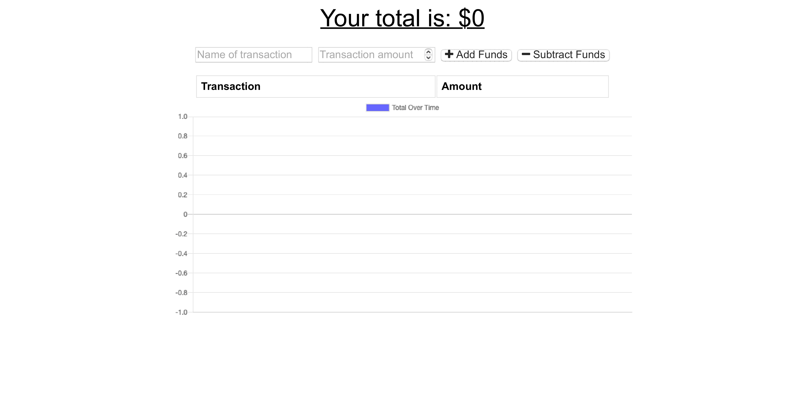

# Progressive_Budget

## Project Description

As an avid traveller
I want to be able to track my withdrawals and deposits with or without a data/internet connection
so that my account balance is accurate when I am traveling

## User Story Criteria

GIVEN a user is on Budget App without an internet connection
WHEN the user inputs a withdrawal or deposit
THEN that will be shown on the page, and added to their transaction history when their connection is back online.

## Deployed Site

Here is an image of the website:

Link to deployed site: https://polar-inlet-94053.herokuapp.com/
